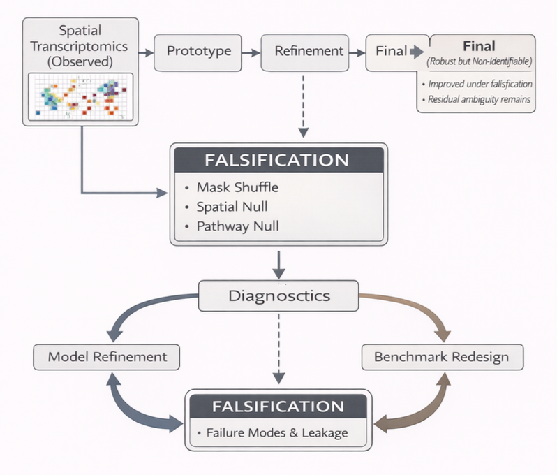

# Falsification-Based Evaluation of Spatial Pathway Models

A falsification-driven framework for evaluating interpretability and identifiability in spatial pathway models.

## Overview

Overview of the falsification framework used to evaluate whether pathway representations genuinely depend on preserved biological structure or instead rely on correlated predictive signals.

Spatial transcriptomics has motivated the development of pathway-based models that aim to provide biologically interpretable representations of gene expression. These models are often evaluated using predictive performance, yet high accuracy does not necessarily imply reliance on the intended biological structure.

This work introduces a falsification-based evaluation framework that directly tests whether model behavior depends on preserved pathway structure and spatial organization. By comparing model performance across controlled perturbations, the framework distinguishes genuine dependence on biological structure from reliance on correlated signals.

Using synthetic benchmarks, diagnostic analyses, model co-design, and real spatial transcriptomics datasets, the study demonstrates that predictive performance can remain high even when pathway structure is disrupted. These findings highlight important limits of interpretability in structured biological models and establish falsification as a practical evaluation criterion.

## Framework

Overview of the falsification framework used to evaluate whether pathway representations genuinely depend on preserved biological structure or instead rely on correlated predictive signals.

## Scientific Contributions

- Introduces a falsification-driven framework for evaluating interpretability in spatial pathway models.
- Establishes controlled perturbation as a direct test of structural dependence.
- Demonstrates that predictive accuracy can persist under disrupted pathway structure.
- Identifies shortcut pathways arising from correlated biological signals.
- Uses falsification-guided co-design to improve model sensitivity to preserved structure.
- Evaluates identifiability of pathway representations in both synthetic and real spatial datasets.
- Reframes interpretability as a testable empirical property rather than an assumed consequence of predictive performance.

## Evaluation Framework

The framework evaluates model behavior under multiple structural conditions:

- **TRUE** — pathway structure and spatial organization preserved.
- **MASK_SHUFFLE** — pathway assignments randomized.
- **SPATIAL_NULL** — spatial relationships disrupted.
- **PATHWAY_NULL** — pathway structure altered while preserving spatial organization.

Performance differences across these conditions provide direct evidence of whether models rely on the intended biological structure.

## Repository Resources

### Manuscript

- `Paper.pdf` Falsification-based evaluation reveals limits of interpretability in spatial pathway models

### Publication Figures

- `Figure1_Falsification_Framework.pdf`
- `Figure2_Synthetic_Benchmark_and_Falsification_Conditions.pdf`
- `Figure3_Failure_Modes_and_Leakage_Diagnostics.pdf`
- `Figure4_CoDesign_and_Residual_Ambiguity.pdf`
- `Figure5_Axis_Identifiability_Across_Datasets.pdf`
- `Figure6_Spatial_Smoothness_vs_Axis_Separation.pdf`
- `Figure7_Spatial_Organization_of_Pathway_Programs.pdf`
- `Figure8_Axis_Separation_by_Response_Status.pdf`
- `Figure9_Statistical_Significance_of_Axis_Separation.pdf`

## Analysis Modules

| Notebook | Purpose |
|-----------|----------|
| `01_synthetic_benchmark_and_falsification.ipynb` | Construction of synthetic spatial benchmarks, pathway masking, falsification worlds, and initial model evaluation. |
| `02_model_refinement_and_diagnostics.ipynb` | Leakage diagnostics, feature isolation experiments, reconstruction analyses, and architecture ablations. |
| `03_spatial_pathway_model_development.ipynb` | Falsification-guided model refinement and co-design experiments. |
| `04_real_data_validation.ipynb` | Application of pathway representations to spatial transcriptomics datasets and axis-level analyses. |
| `05_manuscript_figure_generation.ipynb` | Generation of all publication figures from stored intermediate outputs. |

## Key Findings

- High predictive performance does not guarantee interpretability.
- Pathway representations can often be reconstructed from correlated inputs.
- Local expression, neighborhood information, and compositional effects provide alternative predictive routes.
- Falsification exposes failure modes that remain invisible under conventional evaluation.
- Model redesign can reduce shortcut reliance but cannot completely eliminate residual ambiguity.
- Real spatial transcriptomics datasets exhibit heterogeneous and context-dependent pathway behavior.
- Most pathway axes show weak and non-significant separation between biological conditions.

## Reproducibility

All analyses are provided as executable Jupyter notebooks together with the manuscript and publication figures.

The repository contains:

- synthetic benchmark generation
- falsification procedures
- model development workflows
- diagnostic analyses
- real-data validation
- figure generation pipelines

allowing complete reproduction of the reported results.

## Citation

Yepes S. (2026). *Falsification-based evaluation reveals limits of interpretability in spatial pathway models.*

DOI: https://doi.org/10.5281/zenodo.19476625

